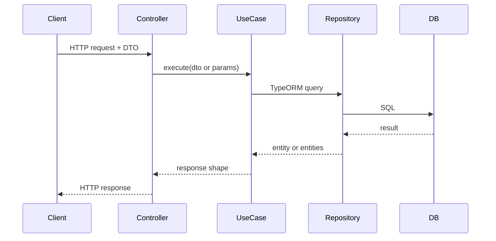

# Architecture

How the PDP Backend is structured and how requests flow through the system.

## Overview

The application is a **modular monolith** built with NestJS 11. Each business area lives in its own module under `src/modules/`. Shared persistence (entities, migrations) lives in `src/database/`.

| Layer | Responsibility |
|-------|----------------|
| **Controller** | HTTP routing, Swagger decorators, delegates to use-cases |
| **Use-case service** | Business logic, orchestration, one `execute()` entry point |
| **Repository** | TypeORM data access (injected via `@InjectRepository`) |
| **Entity** | Database table mapping in `src/database/entities/` |

## Directory structure

```
src/
├── main.ts                    # Bootstrap: Fastify adapter + Swagger
├── app.module.ts              # Root module wiring
├── database/
│   ├── database.module.ts     # TypeORM root config
│   ├── typeOrm.migration-config.ts
│   ├── entities/              # Shared entities
│   └── migrations/            # Versioned schema changes
└── modules/<domain>/
    ├── <domain>.module.ts
    ├── <domain>.controller.ts
    ├── dto/                   # Request/response DTOs
    ├── swagger/               # Swagger response classes (when needed)
    └── use-cases/
        ├── <action>.service.ts
        ├── <action>.service.spec.ts
        └── index.ts           # Barrel export
```

## Request flow



### Example: creating an action plan

1. `POST /action-plans` hits `ActionPlansController.create()`
2. Controller calls `CreateActionPlansService.execute(dto)`
3. Use-case validates user via `GetUserByIdService` (cross-module)
4. Use-case maps DTO fields to `ActionPlansEntity` and saves via repository
5. Returns `{ id }` to the client

## Architectural rules

### Thin controllers

Controllers must not contain business logic. They only:

- Define routes and HTTP methods
- Apply Swagger decorators
- Call `useCase.execute(...)`

Reference: `src/modules/action-plans/action-plans.controller.ts`

### One use-case per action

Each user-facing operation gets its own injectable service with a public `execute()` method:

```
CreateUserService.execute(dto)
GetUserByIdService.execute(id)
CreateActionPlansService.execute(dto)
```

File naming: `<verb>-<noun>.service.ts` (e.g. `get-action-plan-by-id.service.ts`).

### DTOs for input

Request bodies use classes in `dto/` with `@ApiProperty` for Swagger. Validation decorators (`class-validator`) should be added as the API matures.

### Entities are shared

All TypeORM entities live in `src/database/entities/`, not inside feature modules. Feature modules register entities via `TypeOrmModule.forFeature([Entity])`.

### Cross-module dependencies

When one module needs another module's use-case:

1. Export the use-case from the source module's `providers` and `exports`
2. Import the source module in the consumer module
3. Inject the use-case in the consumer's service

Example: `ActionPlansModule` imports `UsersModule` to use `GetUserByIdService`.

Do **not** import another module's repository directly.

### HTTP adapter: Fastify

The app uses `@nestjs/platform-fastify`, not Express. Bootstrap is in `src/main.ts`:

```typescript
const app = await NestFactory.create<NestFastifyApplication>(
  AppModule,
  new FastifyAdapter(),
);
```

E2E tests must also use `FastifyAdapter` (see `test/shared/setup-e2e-app.ts`).

### Configuration

`ConfigModule.forRoot({ isGlobal: true })` loads `.env`. Database connection is configured in `DatabaseModule` via `ConfigService`.

### Schema management

`synchronize: false` — schema changes always go through migrations. Never enable synchronize in production.

## Active modules

| Module | Path | Exposed API |
|--------|------|-------------|
| Healthcheck | `src/modules/healthcheck/` | `GET /healthcheck` |
| Users | `src/modules/users/` | `POST /users` |
| Action Plans | `src/modules/action-plans/` | `POST /action-plans`, `GET /action-plans/:userId`, `GET /action-plans/user/:userId/:id` |

Internal use-cases (not exposed via HTTP):

- `GetUserByIdService` — used by action-plans module
- `GetUserByEmailService` — available but not wired to a controller

## Current limitations (intentional gaps)

| Area | Status |
|------|--------|
| Authentication / authorization | Not implemented — passwords are hashed on user creation only |
| Tasks API | Entity and migration exist; no module or endpoints yet |
| Action plan update/delete | Not implemented |
| Global validation pipe | Not configured — DTO validation is minimal today |
| OpenAPI export | Runtime-only at `/api/docs` — no committed spec file |

## Adding a new module

Follow the checklist in [api-conventions.md](./api-conventions.md). At minimum:

1. Create entity in `src/database/entities/` + migration
2. Create `src/modules/<domain>/` with module, controller, use-cases, DTOs
3. Register module in `app.module.ts`
4. Add unit specs and e2e specs per [testing.md](./testing.md)

## Related docs

- [Domain Model](./domain.md) — business entities and rules
- [API Conventions](./api-conventions.md) — REST and Swagger patterns
- [Database](./database.md) — migrations and TypeORM conventions
- [Testing](./testing.md) — test structure and harness
