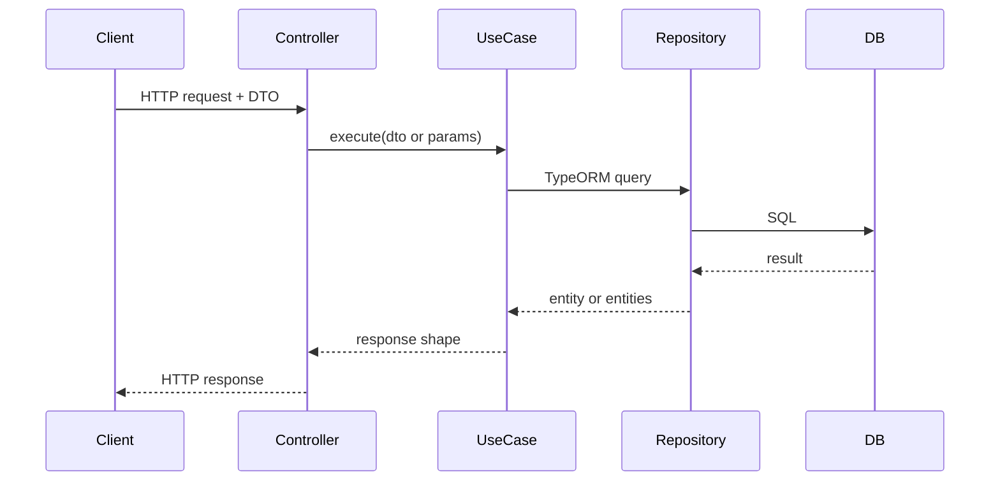
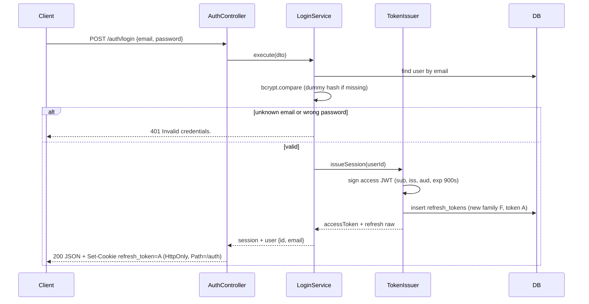
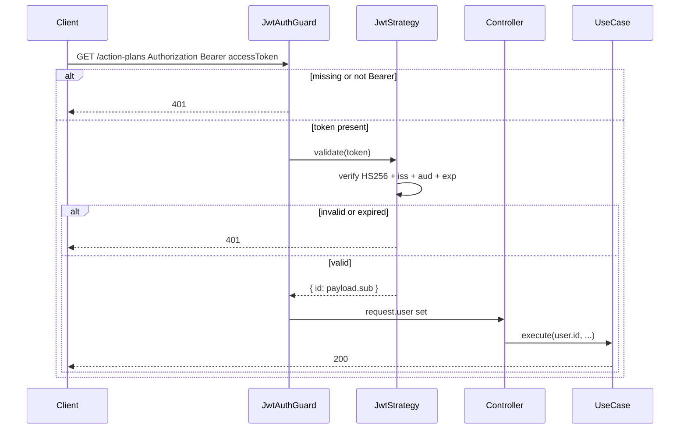
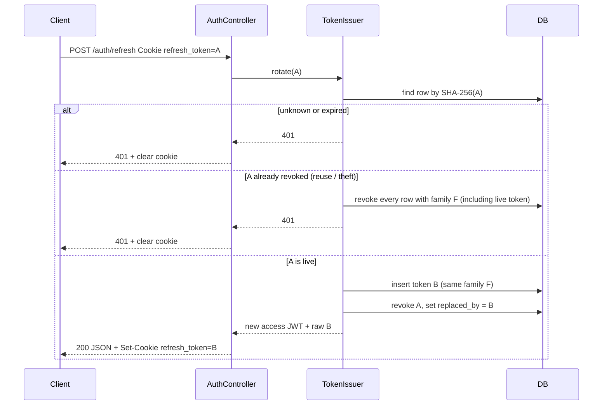
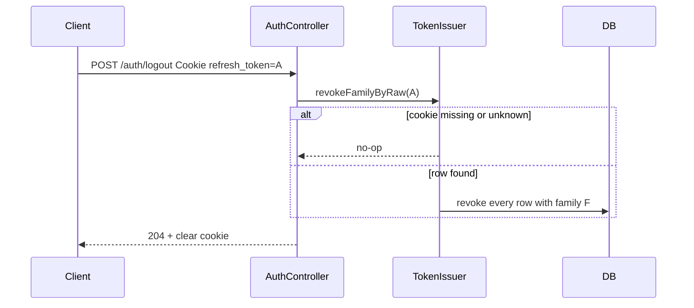

# Architecture

How the PDP Backend is structured and how requests flow through the system.

## Overview

The application is a **modular monolith** built with NestJS 11. Each business area lives in its own module under `src/modules/`. Shared persistence (entities, migrations) lives in `src/database/`.

| Layer | Responsibility |
|-------|----------------|
| **Controller** | HTTP routing, Swagger decorators, delegates to use-cases |
| **Auth** | Global JWT guard, access token verification, refresh-token cookies |
| **Use-case service** | Business logic, orchestration, one `execute()` entry point |
| **Repository** | TypeORM data access (injected via `@InjectRepository`) |
| **Entity** | Database table mapping in `src/database/entities/` |

## Directory structure

```
src/
├── main.ts                    # Bootstrap: Fastify adapter + configureApp
├── configure-app.ts           # Cookies, Helmet, CORS, ValidationPipe, Swagger
├── app.module.ts              # Root module wiring
├── database/
│   ├── database.module.ts     # TypeORM root config
│   ├── typeOrm.migration-config.ts
│   ├── entities/              # Shared entities
│   └── migrations/            # Versioned schema changes
└── modules/<domain>/
    ├── <domain>.module.ts
    ├── <domain>.controller.ts
    ├── dto/                   # Request/response DTOs
    ├── swagger/               # Swagger response classes (when needed)
    └── use-cases/
        ├── <action>.service.ts
        ├── <action>.service.spec.ts
        └── index.ts           # Barrel export
```

## Request flow


```mermaid
sequenceDiagram
  participant Client
  participant Controller
  participant UseCase
  participant Repository
  participant DB

  Client->>Controller: HTTP request + DTO
  Controller->>UseCase: execute(dto or params)
  UseCase->>Repository: TypeORM query
  Repository->>DB: SQL
  DB-->>Repository: result
  Repository-->>UseCase: entity or entities
  UseCase-->>Controller: response shape
  Controller-->>Client: HTTP response
```

### Example: creating an action plan

1. Client sends `Authorization: Bearer <accessToken>` (except public routes)
2. `POST /action-plans` hits `ActionPlansController.create()`
3. Controller reads `@CurrentUser()` and calls `CreateActionPlansService.execute(userId, dto)`
4. Use-case maps DTO fields to `ActionPlansEntity` (owner is the token user) and saves via repository
5. Returns `{ id }` to the client

## Authentication flow

Access JWTs are stateless (not stored). Refresh tokens are opaque, hashed at rest, and grouped by `family_id` (one family per login). `POST /auth/login`, `/auth/refresh`, and `/auth/logout` are public with respect to the access token.

### Login


```mermaid
sequenceDiagram
  participant Client
  participant AuthController
  participant LoginService
  participant TokenIssuer
  participant DB

  Client->>AuthController: POST /auth/login {email, password}
  AuthController->>LoginService: execute(dto)
  LoginService->>DB: find user by email
  LoginService->>LoginService: bcrypt.compare (dummy hash if missing)
  alt unknown email or wrong password
    LoginService-->>Client: 401 Invalid credentials.
  else valid
    LoginService->>TokenIssuer: issueSession(userId)
    TokenIssuer->>TokenIssuer: sign access JWT (sub, iss, aud, exp 900s)
    TokenIssuer->>DB: insert refresh_tokens (new family F, token A)
    TokenIssuer-->>LoginService: accessToken + refresh raw
    LoginService-->>AuthController: session + user {id, email}
    AuthController-->>Client: 200 JSON + Set-Cookie refresh_token=A (HttpOnly, Path=/auth)
  end
```

The JSON body is `{ accessToken, tokenType: Bearer, expiresIn, user }`. The refresh raw value is never in JSON.

### Protected request


```mermaid
sequenceDiagram
  participant Client
  participant JwtAuthGuard
  participant JwtStrategy
  participant Controller
  participant UseCase

  Client->>JwtAuthGuard: GET /action-plans Authorization Bearer accessToken
  alt missing or not Bearer
    JwtAuthGuard-->>Client: 401
  else token present
    JwtAuthGuard->>JwtStrategy: validate(token)
    JwtStrategy->>JwtStrategy: verify HS256 + iss + aud + exp
    alt invalid or expired
      JwtStrategy-->>Client: 401
    else valid
      JwtStrategy-->>JwtAuthGuard: { id: payload.sub }
      JwtAuthGuard->>Controller: request.user set
      Controller->>UseCase: execute(user.id, ...)
      UseCase-->>Client: 200
    end
  end
```

`@Public()` routes skip the guard (`GET /healthcheck`, `POST /users`, `POST /auth/*`).

### Refresh (rotate) and reuse


```mermaid
sequenceDiagram
  participant Client
  participant AuthController
  participant TokenIssuer
  participant DB

  Client->>AuthController: POST /auth/refresh Cookie refresh_token=A
  AuthController->>TokenIssuer: rotate(A)
  TokenIssuer->>DB: find row by SHA-256(A)
  alt unknown or expired
    TokenIssuer-->>AuthController: 401
    AuthController-->>Client: 401 + clear cookie
  else A already revoked (reuse / theft)
    TokenIssuer->>DB: revoke every row with family F (including live token)
    TokenIssuer-->>AuthController: 401
    AuthController-->>Client: 401 + clear cookie
  else A is live
    TokenIssuer->>DB: insert token B (same family F)
    TokenIssuer->>DB: revoke A, set replaced_by = B
    TokenIssuer-->>AuthController: new access JWT + raw B
    AuthController-->>Client: 200 JSON + Set-Cookie refresh_token=B
  end
```

`family_id` is stable for one login. Refresh walks the chain (A → B → C). Replaying a rotated cookie kills the whole family so a stolen old cookie cannot coexist with the legitimate client's current cookie.

### Logout


```mermaid
sequenceDiagram
  participant Client
  participant AuthController
  participant TokenIssuer
  participant DB

  Client->>AuthController: POST /auth/logout Cookie refresh_token=A
  AuthController->>TokenIssuer: revokeFamilyByRaw(A)
  alt cookie missing or unknown
    TokenIssuer-->>AuthController: no-op
  else row found
    TokenIssuer->>DB: revoke every row with family F
  end
  AuthController-->>Client: 204 + clear cookie
```

Logout does not require a Bearer token. The access JWT can still work until `exp` (max 900s); there is no access-token denylist.

## Architectural rules

### Thin controllers

Controllers must not contain business logic. They only:

- Define routes and HTTP methods
- Apply Swagger decorators
- Call `useCase.execute(...)`

Reference: `src/modules/action-plans/action-plans.controller.ts`

### One use-case per action

Each user-facing operation gets its own injectable service with a public `execute()` method:

```
CreateUserService.execute(dto)
GetUserByIdService.execute(id)
CreateActionPlansService.execute(userId, dto)
LoginService.execute(dto)
```

File naming: `<verb>-<noun>.service.ts` (e.g. `get-action-plan-by-id.service.ts`).

### DTOs for input

Request bodies use classes in `dto/` with `@ApiProperty` for Swagger. Validation decorators (`class-validator`) should be added as the API matures.

### Entities are shared

All TypeORM entities live in `src/database/entities/`, not inside feature modules. Feature modules register entities via `TypeOrmModule.forFeature([Entity])`.

### Cross-module dependencies

When one module needs another module's use-case:

1. Export the use-case from the source module's `providers` and `exports`
2. Import the source module in the consumer module
3. Inject the use-case in the consumer's service

Example: `ActionPlansModule` imports `UsersModule` to use `GetUserByIdService`.

Do **not** import another module's repository directly.

### HTTP adapter: Fastify

The app uses `@nestjs/platform-fastify`, not Express. Bootstrap is in `src/main.ts` via `configureApp` (cookies, Helmet, CORS with credentials, global `ValidationPipe`, Swagger Bearer auth).

E2E tests must also use `FastifyAdapter` and `configureApp` (see `test/shared/setup-e2e-app.ts`).

### Configuration

`ConfigModule.forRoot({ isGlobal: true })` loads `.env`. Database connection is configured in `DatabaseModule` via `ConfigService`.

### Schema management

`synchronize: false` — schema changes always go through migrations. Never enable synchronize in production.

## Active modules

| Module | Path | Exposed API |
|--------|------|-------------|
| Healthcheck | `src/modules/healthcheck/` | `GET /healthcheck` (public) |
| Auth | `src/modules/auth/` | `POST /auth/login`, `POST /auth/refresh`, `POST /auth/logout` (public w.r.t. access token) |
| Users | `src/modules/users/` | `POST /users` (public, rate-limited) |
| Action Plans | `src/modules/action-plans/` | `POST /action-plans`, `GET /action-plans`, `GET /action-plans/:id` (Bearer required; no client `userId`) |
| Tasks | `src/modules/tasks/` | `POST /tasks`, `GET /tasks?actionPlanId=`, `GET /tasks/:id`, `POST /tasks/:id/start`, `POST /tasks/:id/complete`, `DELETE /tasks/:id` (Bearer required) |

Internal use-cases (not exposed via HTTP):

- `GetUserByIdService` — used by action-plans module
- `GetUserByEmailService` — used by login (returns `null` when missing)
- `FindActionPlanByIdService` — used by tasks module (lookup by id)
- `TokenIssuer` — signs access JWTs and rotates hashed refresh tokens

Protected routes receive `AuthenticatedUser` via `@CurrentUser()`. Identity on login and refresh is `user: { id, email }` in the JSON body. There is no `GET /users/me`.

## Current limitations (intentional gaps)

| Area | Status |
|------|--------|
| OAuth / password reset / email verify | Not implemented |
| Action plan update/delete | Not implemented |
| Access-token denylist | Not implemented — access JWTs live until expiry (max 900s) |
| OpenAPI export | Runtime-only at `/api/docs` — no committed spec file |

## Adding a new module

Follow the checklist in [api-conventions.md](./api-conventions.md). At minimum:

1. Create entity in `src/database/entities/` + migration
2. Create `src/modules/<domain>/` with module, controller, use-cases, DTOs
3. Register module in `app.module.ts`
4. Add unit specs and e2e specs per [testing.md](./testing.md)

## Related docs

- [Domain Model](./domain.md) — business entities and rules
- [API Conventions](./api-conventions.md) — REST and Swagger patterns
- [Database](./database.md) — migrations and TypeORM conventions
- [Testing](./testing.md) — test structure and harness
