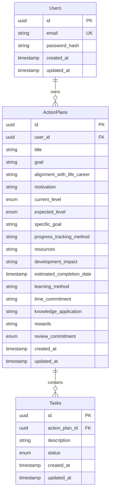

# Domain Model

Business concepts, data relationships, and current API behavior for the PDP (Personal Development Plan) system.

## Glossary

| Term | Description |
|------|-------------|
| **PDP / Action Plan** | A structured personal development plan with goals, skill levels, learning methods, and review commitments |
| **User** | Account owner who creates and owns action plans |
| **Task** | A concrete action item linked to an action plan, tracked by status |

## Entity relationships

Foreign keys:

- `action_plans.user_id` → `users.id`
- `tasks.action_plan_id` → `action_plans.id` (CASCADE on delete)

## Enums

### CurrentLevelEnum

Skill level at the start of the plan.

| Value | Meaning |
|-------|---------|
| `BEGINNER` | Starting from scratch |
| `INTERMEDIARY` | Some prior knowledge |
| `ADVANCED` | Strong existing foundation |
| `EXPERT` | Near mastery |

Defined in: `src/database/entities/action-plans.entity.ts`, `src/modules/action-plans/dto/create-action-plan.dto.ts`

### ExpectedLevelEnum

Target outcome of the plan.

**Entity / database** (`action-plans.entity.ts`):

| Value | Meaning |
|-------|---------|
| `ACHIEVE_NEXT_LEVEL` | Move to the next skill tier |
| `ENHANCE_CURRENT_LEVEL` | Deepen skills at current tier |

**DTO** (`create-action-plan.dto.ts`) — **differs from entity**:

| Value |
|-------|
| `ENHANCE_CURRENT_LEVEL` |
| `INTERMEDIARY` |
| `ADVANCED` |
| `EXPERT` |

This mismatch is a known inconsistency. New work should align DTO and entity before adding more endpoints.

### ReviewCommitmentEnum

How often the user commits to reviewing the plan.

**Entity:**

| Value |
|-------|
| `DAILY` |
| `WEEKLY` |
| `BIWEEKLY` |
| `MONTHLY` |

**DTO** — missing `DAILY`:

| Value |
|-------|
| `WEEKLY` |
| `BIWEEKLY` |
| `MONTHLY` |

### TaskStatusEnum

| Value | Meaning |
|-------|---------|
| `NOT_STARTED` | Task not yet begun |
| `IN_PROGRESS` | Task in active work |
| `DONE` | Task completed |

Defined in: `src/database/entities/tasks.entity.ts`

## Domain rules (current behavior)

### Users

| Rule | Detail |
|------|--------|
| Email uniqueness | Duplicate email returns `409 Conflict` with message `User already exists.` |
| Password storage | Hashed with bcrypt (10 rounds) on create; never returned in API responses |
| Create response | Returns `{ id, email }` only |

### Action Plans

| Rule | Detail |
|------|--------|
| User must exist | `userId` is validated via `GetUserByIdService` before create or read |
| Missing user | Returns `400 Bad Request` with message `User does not exists.` |
| Create response | Returns `{ id }` only |
| List by user | `GET /action-plans?userId=` returns full action plan objects for that user |
| Get by id | `GET /action-plans/:id?userId=` returns one plan; `404` if not found for that user |

### Tasks

| Rule | Detail |
|------|--------|
| Schema | Table `tasks` exists with FK to `action_plans` |
| API | **Not implemented** — no module, controller, or endpoints |

### Healthcheck

| Rule | Detail |
|------|--------|
| Response | `GET /healthcheck` returns `{ health: 'ok' }` |

## API surface (as-is)

| Domain | Method | Route | Status codes |
|--------|--------|-------|--------------|
| healthcheck | `GET` | `/healthcheck` | `200` |
| users | `POST` | `/users` | `201`, `409` |
| action-plans | `POST` | `/action-plans` | `201`, `400` |
| action-plans | `GET` | `/action-plans?userId=` | `200`, `400` |
| action-plans | `GET` | `/action-plans/:id?userId=` | `200`, `400`, `404` |
| tasks | — | — | Not implemented |

Interactive documentation: `http://localhost:3000/api/docs`

## Known inconsistencies

Document these so agents do not copy incorrect patterns:

| Issue | Location | Detail |
|-------|----------|--------|
| `ExpectedLevelEnum` mismatch | Entity vs DTO | Entity uses goal-oriented values; DTO uses skill-level values |
| `ReviewCommitmentEnum` mismatch | Entity vs DTO | Entity includes `DAILY`; DTO does not |
| `timeCommitment` type | Entity | TypeScript property typed as `number`, DB column is `varchar` |
| Action plan `id` in e2e | `test/action-plans/` | Some tests expect numeric id; migrations use UUID |

## Planned areas (not yet specified)

These are implied by the schema or product direction but have no API or OpenSpec requirements yet:

- User authentication (login, JWT/session)
- Tasks CRUD under an action plan
- Action plan update and delete
- Pagination for list endpoints

When implementing any of these, start with a focused change spec (future OpenSpec workflow) rather than expanding this document with implementation details.

## Related docs

- [Architecture](./architecture.md) — how modules implement this domain
- [API Conventions](./api-conventions.md) — endpoint and response patterns
- [Database](./database.md) — table and migration details
