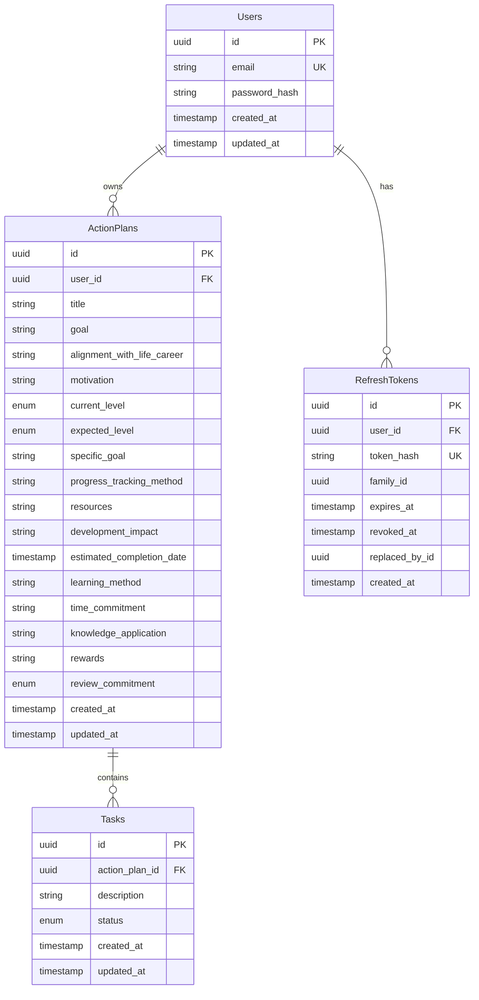

# Domain Model

Business concepts, data relationships, and current API behavior for the PDP (Personal Development Plan) system.

## Glossary

| Term | Description |
|------|-------------|
| **PDP / Action Plan** | A structured personal development plan with goals, skill levels, learning methods, and review commitments |
| **User** | Account owner who creates and owns action plans |
| **Task** | A concrete action item linked to an action plan, tracked by status |

## Entity relationships

```mermaid
erDiagram
  Users ||--o{ ActionPlans : owns
  Users ||--o{ RefreshTokens : has
  ActionPlans ||--o{ Tasks : contains

  Users {
    uuid id PK
    string email UK
    string password_hash
    timestamp created_at
    timestamp updated_at
  }

  RefreshTokens {
    uuid id PK
    uuid user_id FK
    string token_hash UK
    uuid family_id
    timestamp expires_at
    timestamp revoked_at
    uuid replaced_by_id
    timestamp created_at
  }

  ActionPlans {
    uuid id PK
    uuid user_id FK
    string title
    string goal
    string alignment_with_life_career
    string motivation
    enum current_level
    enum expected_level
    string specific_goal
    string progress_tracking_method
    string resources
    string development_impact
    timestamp estimated_completion_date
    string learning_method
    string time_commitment
    string knowledge_application
    string rewards
    enum review_commitment
    timestamp created_at
    timestamp updated_at
  }

  Tasks {
    uuid id PK
    uuid action_plan_id FK
    string description
    enum status
    timestamp created_at
    timestamp updated_at
  }
```

Foreign keys:

- `action_plans.user_id` → `users.id`
- `tasks.action_plan_id` → `action_plans.id` (CASCADE on delete)
- `refresh_tokens.user_id` → `users.id` (CASCADE on delete)

## Enums

### CurrentLevelEnum

Skill level at the start of the plan.

| Value | Meaning |
|-------|---------|
| `BEGINNER` | Starting from scratch |
| `INTERMEDIARY` | Some prior knowledge |
| `ADVANCED` | Strong existing foundation |
| `EXPERT` | Near mastery |

Defined in: `src/database/entities/action-plans.entity.ts`, `src/modules/action-plans/dto/create-action-plan.dto.ts`

### ExpectedLevelEnum

Target outcome of the plan.

**Entity / database** (`action-plans.entity.ts`):

| Value | Meaning |
|-------|---------|
| `ACHIEVE_NEXT_LEVEL` | Move to the next skill tier |
| `ENHANCE_CURRENT_LEVEL` | Deepen skills at current tier |

**DTO** (`create-action-plan.dto.ts`) — **differs from entity**:

| Value |
|-------|
| `ENHANCE_CURRENT_LEVEL` |
| `INTERMEDIARY` |
| `ADVANCED` |
| `EXPERT` |

This mismatch is a known inconsistency. New work should align DTO and entity before adding more endpoints.

### ReviewCommitmentEnum

How often the user commits to reviewing the plan.

**Entity:**

| Value |
|-------|
| `DAILY` |
| `WEEKLY` |
| `BIWEEKLY` |
| `MONTHLY` |

**DTO** — missing `DAILY`:

| Value |
|-------|
| `WEEKLY` |
| `BIWEEKLY` |
| `MONTHLY` |

### TaskStatusEnum

| Value | Meaning |
|-------|---------|
| `NOT_STARTED` | Task not yet begun |
| `IN_PROGRESS` | Task in active work |
| `DONE` | Task completed |

Defined in: `src/database/entities/tasks.entity.ts`

## Domain rules (current behavior)

### Users

| Rule | Detail |
|------|--------|
| Email uniqueness | Duplicate email returns `409 Conflict` with message `User already exists.` |
| Password storage | Hashed with async bcrypt (cost 12) on create; never returned in API responses |
| Create response | Returns `{ id, email }` only |
| Public lookups | `GET /users/:id`, `GET /users/email/:email`, and `GET /users/me` are not exposed |
| Identity for the SPA | Returned as `user: { id, email }` on `POST /auth/login` and `POST /auth/refresh` |

### Auth

Sequence diagrams for login, protected requests, refresh/reuse, and logout are in [architecture.md](./architecture.md#authentication-flow).

| Rule | Detail |
|------|--------|
| Login | `POST /auth/login` with email/password; 200 with access JWT + `user`; refresh cookie set |
| Invalid login | Unknown email and wrong password both return `401` with `Invalid credentials.` |
| Access token | Bearer JWT, at most 900 seconds, payload `sub`/`iss`/`aud`/`iat`/`exp` |
| Refresh cookie | HttpOnly, `Path=/auth`, SameSite/Secure from env, opaque (not a JWT), max 7 days |
| Refresh | `POST /auth/refresh` rotates the cookie and returns a new access token + `user` |
| Reuse | Replaying a rotated refresh token revokes the family and returns 401 |
| Logout | `POST /auth/logout` revokes the family, clears the cookie, returns 204 |
| Public routes | `GET /healthcheck`, `POST /users`, `POST /auth/login`, `POST /auth/refresh`, `POST /auth/logout` |

### Action Plans

| Rule | Detail |
|------|--------|
| Owner | Taken from the access token; the body/query must not supply `userId` |
| Create response | Returns `{ id }` only |
| List | `GET /action-plans` returns full action plan objects for the authenticated user |
| Get by id | `GET /action-plans/:id` returns one plan; missing and foreign plans both `404` with `Action plan not found.` |

### Tasks

| Rule | Detail |
|------|--------|
| Parent plan must exist and be owned | `actionPlanId` is validated; foreign plans use the same errors as missing |
| Missing or foreign plan | Create/list return `400` with `Action plan does not exists.` |
| No user identifier | Task endpoints do not accept `userId`; ownership is the parent plan + access token |
| Create | Status is `NOT_STARTED`; response is `{ id }` |
| Start | `POST /tasks/:id/start` sets `IN_PROGRESS`; already `IN_PROGRESS` is idempotent; `DONE` returns `400` with `Task is already done.` |
| Complete | `POST /tasks/:id/complete` sets `DONE` from `IN_PROGRESS`; already `DONE` is idempotent; `NOT_STARTED` returns `400` with `Task has not been started.` |
| Missing or foreign task | Get, start, complete, and delete return `404` with `Task not found.` |
| Delete | Returns `204 No Content` |

### Healthcheck

| Rule | Detail |
|------|--------|
| Response | `GET /healthcheck` returns `{ health: 'ok' }` |

## API surface (as-is)

| Domain | Method | Route | Status codes |
|--------|--------|-------|--------------|
| healthcheck | `GET` | `/healthcheck` | `200` |
| users | `POST` | `/users` | `201`, `409`, `429` |
| auth | `POST` | `/auth/login` | `200`, `400`, `401`, `429` |
| auth | `POST` | `/auth/refresh` | `200`, `401`, `429` |
| auth | `POST` | `/auth/logout` | `204` |
| action-plans | `POST` | `/action-plans` | `201`, `400`, `401` |
| action-plans | `GET` | `/action-plans` | `200`, `401` |
| action-plans | `GET` | `/action-plans/:id` | `200`, `401`, `404` |
| tasks | `POST` | `/tasks` | `201`, `400`, `401` |
| tasks | `GET` | `/tasks?actionPlanId=` | `200`, `400`, `401` |
| tasks | `GET` | `/tasks/:id` | `200`, `401`, `404` |
| tasks | `POST` | `/tasks/:id/start` | `200`, `400`, `401`, `404` |
| tasks | `POST` | `/tasks/:id/complete` | `200`, `400`, `401`, `404` |
| tasks | `DELETE` | `/tasks/:id` | `204`, `401`, `404` |

Interactive documentation: `http://localhost:3000/api/docs`

## Known inconsistencies

Document these so agents do not copy incorrect patterns:

| Issue | Location | Detail |
|-------|----------|--------|
| `ExpectedLevelEnum` mismatch | Entity vs DTO | Entity uses goal-oriented values; DTO uses skill-level values |
| `ReviewCommitmentEnum` mismatch | Entity vs DTO | Entity includes `DAILY`; DTO does not |
| `timeCommitment` type | Entity | TypeScript property typed as `number`, DB column is `varchar` |
| Action plan `id` in e2e | `test/action-plans/` | Some tests expect numeric id; migrations use UUID |

## Planned areas (not yet specified)

These are implied by the schema or product direction but have no API or OpenSpec requirements yet:

- Pagination for list endpoints

When implementing any of these, start with a focused change spec (future OpenSpec workflow) rather than expanding this document with implementation details.

## Related docs

- [Architecture](./architecture.md) — how modules implement this domain
- [API Conventions](./api-conventions.md) — endpoint and response patterns
- [Database](./database.md) — table and migration details
